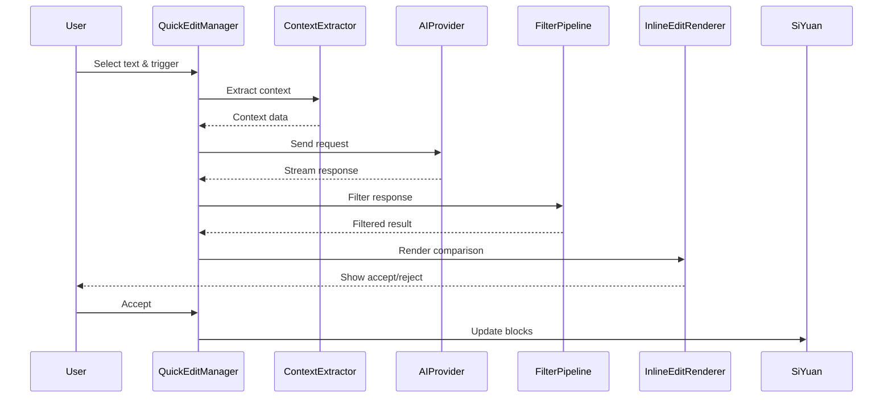
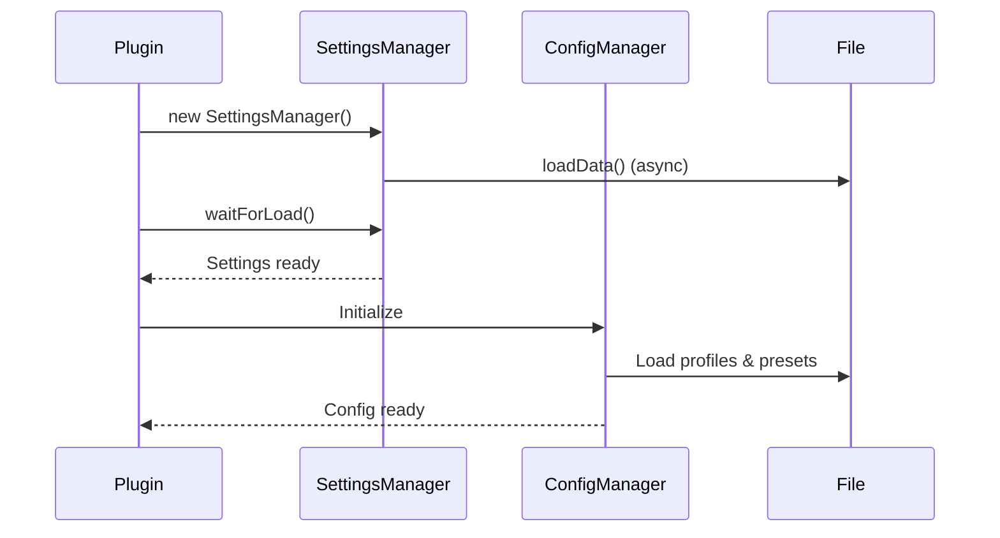

# SiYuan Note Claude Plugin - Architecture Documentation

**Version**: 0.9.0
**Last Updated**: 2025-01-06

---

## Table of Contents

1. [Overview](#overview)
2. [Core Architecture](#core-architecture)
3. [Module Details](#module-details)
4. [Data Flow](#data-flow)
5. [Extensibility Points](#extensibility-points)
6. [Security Considerations](#security-considerations)

---

## Overview

SiYuan Note Claude Plugin 是一个为思源笔记设计的 AI 助手插件，提供对话和快速编辑功能。

### 技术栈

- **语言**: TypeScript 5+
- **UI Framework**: Svelte
- **Build Tool**: Vite
- **AI SDK**: Anthropic SDK, (可扩展)
- **主要依赖**: marked, DOMPurify, diff-match-patch

---

## Core Architecture

```
┌─────────────────────────────────────────────────────────────┐
│                     Plugin Entry (index.ts)                  │
└─────────────────────────────────────────────────────────────┘
         │
         ├─── Configuration ───┐
         │                     │
         │    ┌────────────────▼─────────────────┐
         │    │   ConfigManager                   │
         │    │   - Profiles                      │
         │    │   - Presets                       │
         │    │   - Settings                      │
         │    └───────────────────────────────────┘
         │
         ├─── AI Layer ────────┐
         │                     │
         │    ┌────────────────▼─────────────────┐
         │    │   AIProviderFactory               │
         │    │   ├─ AnthropicProvider (Claude)  │
         │    │   ├─ OpenAIProvider (待实现)     │
         │    │   └─ Custom Providers            │
         │    └───────────────────────────────────┘
         │
         ├─── Features ────────┐
         │                     │
         │    ┌────────────────▼─────────────────┐
         │    │   QuickEditManager               │
         │    │   - Selection Handling           │
         │    │   - Context Extraction           │
         │    │   - Response Rendering           │
         │    └───────────────────────────────────┘
         │
         │    ┌──────────────────────────────────┐
         │    │   UnifiedAIPanel (Chat)          │
         │    │   - Conversation Management       │
         │    │   - Streaming Display            │
         │    └───────────────────────────────────┘
         │
         └─── Filtering ───────┐
                              │
              ┌───────────────▼────────────────────┐
              │   FilterPipeline                   │
              │   ├─ RegexFilterMiddleware         │
              │   ├─ CodeBlockNormalizer           │
              │   ├─ MarkdownLinkFixer             │
              │   └─ Custom Middleware             │
              └────────────────────────────────────┘
```

---

## Module Details

### 1. Configuration Module (`src/settings/`)

**职责**: 管理插件配置、预设和多配置文件

**核心类**:
- `ConfigManager` - 配置管理器（配置文件、预设）
- `SettingsManager` - 设置持久化（localStorage + 文件）
- `PromptEditorPanel` - 设置 UI

**数据结构**:
```typescript
ConfigProfile {
    id: string
    name: string
    settings: ClaudeSettings
}

PromptTemplate {
    id: string
    name: string
    systemPrompt: string
    appendedPrompt: string
    editInstruction?: string
    inputPlaceholder?: string
    filterRules?: FilterRule[]
    selectionQATemplate?: string
}
```

**扩展点**:
- 自定义配置文件
- 预设导入/导出
- 配置迁移钩子

---

### 2. AI Provider Module (`src/ai/`)

**职责**: AI 服务抽象层，支持多种 AI 提供商

**核心接口**:
```typescript
interface AIProvider {
    readonly providerType: 'anthropic' | 'openai' | 'gemini' | 'custom'
    readonly providerName: string

    sendMessage(messages, options): Promise<string>
    streamMessage(messages, options): Promise<void>
    validateConfig(config): boolean | string
    getAvailableModels(): string[]
}
```

**已实现**:
- `AnthropicProvider` - Anthropic Claude 支持

**待实现**:
- `OpenAIProvider` - GPT-4, GPT-3.5
- `GeminiProvider` - Google Gemini
- `LocalModelProvider` - Ollama, LM Studio

**使用示例**:
```typescript
const provider = AIProviderFactory.create({
    provider: 'anthropic',
    modelId: 'claude-3-5-sonnet-20241022',
    apiKey: 'sk-...',
    maxTokens: 4096
});

await provider.streamMessage(messages, {
    systemPrompt: 'You are a helpful assistant',
    onStream: (chunk) => console.log(chunk)
});
```

**扩展指南**:
```typescript
// 1. 实现 AIProvider 接口
class MyCustomProvider implements AIProvider {
    readonly providerType = 'custom';
    readonly providerName = 'My AI Service';

    async sendMessage(messages, options) {
        // 实现消息发送逻辑
    }

    async streamMessage(messages, options) {
        // 实现流式响应逻辑
    }

    validateConfig(config) {
        // 验证配置
        return true;
    }

    getAvailableModels() {
        return ['model-v1', 'model-v2'];
    }
}

// 2. 注册到工厂
AIProviderFactory.register({
    type: 'custom',
    factory: (config) => new MyCustomProvider(config),
    displayName: 'My AI Service',
    description: 'Custom AI provider'
});
```

---

### 3. Filter Pipeline Module (`src/filter/`)

**职责**: 响应内容过滤和转换

**核心组件**:
- `FilterPipeline` - 中间件管道
- `FilterMiddleware` - 中间件接口
- 内置中间件集合

**中间件生命周期**:
```
原始响应 → RegexFilter → CodeBlockNormalizer →
MarkdownLinkFixer → WhitespaceTrimmer → 过滤后响应
```

**Context 传递**:
```typescript
interface FilterContext {
    originalResponse: string     // 原始响应
    currentResponse: string      // 当前响应（可能已被修改）
    feature: string              // 功能名称
    presetId?: string            // 预设 ID
    metadata: Map<string, any>   // 中间件间共享数据
}
```

**自定义中间件示例**:
```typescript
class MyCustomMiddleware implements FilterMiddleware {
    readonly name = 'MyCustomFilter';

    process(response: string, context: FilterContext): string {
        // 访问元数据
        const userPreference = context.metadata.get('preference');

        // 转换响应
        let transformed = response;
        // ... 自定义逻辑

        // 存储元数据供后续中间件使用
        context.metadata.set('wasTransformed', true);

        return transformed;
    }

    validate(): boolean | string {
        // 可选：验证配置
        return true;
    }
}

// 使用
const pipeline = new FilterPipeline();
pipeline.use(new MyCustomMiddleware());
const filtered = await pipeline.execute(response, 'QuickEdit');
```

**性能优化**:
- 同步中间件使用 `executeSync()` 避免 Promise 开销
- 中间件按需启用（条件中间件）
- 错误隔离（一个中间件失败不影响整个管道）

---

### 4. Quick Edit Module (`src/quick-edit/`)

**职责**: 快速编辑功能实现

**核心组件**:
- `QuickEditManager` - 主控制器（待拆分）
- `ContextExtractor` - 上下文提取器
- `InlineEditRenderer` - UI 渲染
- `InstructionInputPopup` - 指令输入弹窗

**处理流程**:
```
1. 用户选择文本 → QuickEditManager.trigger()
2. 提取选区和上下文 → ContextExtractor
3. 显示预设选择弹窗 → InstructionInputPopup
4. 构建 AI 提示词 → PromptBuilder (待实现)
5. 调用 AI API → AIProvider
6. 应用过滤规则 → FilterPipeline
7. 渲染对比视图 → InlineEditRenderer
8. 用户接受/拒绝 → handleAccept/handleReject
```

**安全性**:
- blockId 验证防止 SQL 注入 (ContextExtractor:353)
- XSS 防护使用 escapeHtml (InlineEditRenderer)

**待重构**:
QuickEditManager 当前 2078 行，计划拆分为：
- `SelectionHandler` - 处理选区和验证
- `PromptBuilder` - 构建提示词
- `BlockOperations` - SiYuan API 调用
- `EditStateManager` - 状态管理
- `QuickEditOrchestrator` - 协调器（<300 行）

---

### 5. Chat Module (`src/sidebar/`)

**职责**: 对话功能实现

**核心组件**:
- `UnifiedAIPanel` - 主界面
- `TextSelectionManager` - 选区监控

**特性**:
- 流式响应显示
- Markdown 渲染（marked + DOMPurify）
- 上下文管理
- 对话历史

---

## Data Flow

### Quick Edit Flow



### Configuration Loading



---

## Extensibility Points

### 1. 添加新 AI Provider

```typescript
// 1. 实现接口
class NewProvider implements AIProvider { ... }

// 2. 注册
AIProviderFactory.register({
    type: 'new-provider',
    factory: (config) => new NewProvider(config),
    displayName: 'New AI Service',
    description: 'Description'
});

// 3. 在设置中添加选项（UI层）
```

### 2. 添加过滤中间件

```typescript
// 1. 实现中间件
class NewMiddleware implements FilterMiddleware {
    readonly name = 'NewFilter';
    process(response, context) { ... }
}

// 2. 注册到管道
filterPipeline.use(new NewMiddleware());
```

### 3. 添加新预设模板

```typescript
// 在 config-types.ts 的 BUILTIN_TEMPLATES 中添加
export const BUILTIN_TEMPLATES: PromptTemplate[] = [
    // ... 现有预设
    {
        id: 'new-preset',
        name: '新预设',
        systemPrompt: '...',
        editInstruction: '...',
        filterRules: [...]
    }
];
```

---

## Security Considerations

### 1. 输入验证

**SQL 注入防护**:
```typescript
// ContextExtractor.ts:353
private sanitizeBlockId(blockId: string): string {
    if (!/^[0-9a-z]{14,22}$/i.test(blockId)) {
        throw new Error(`Invalid block ID format`);
    }
    return blockId;
}
```

**XSS 防护**:
```typescript
// 所有用户输入在 innerHTML 之前使用 escapeHtml
function escapeHtml(unsafe: string): string {
    return unsafe
        .replace(/&/g, "&amp;")
        .replace(/</g, "&lt;")
        .replace(/>/g, "&gt;")
        .replace(/"/g, "&quot;")
        .replace(/'/g, "&#039;");
}
```

### 2. API Key 存储

- localStorage 存储（未加密）
- 仅浏览器访问
- ⚠️ 用户需自行保护设备安全

### 3. ReDoS 防护

```typescript
// ResponseFilter.ts - Regex 超时保护
private validateRegex(pattern: string): void {
    // 检测潜在的 ReDoS 模式
    // 限制复杂度
}
```

---

## Performance Optimizations

### 已实现

1. **Array Accumulation** (QuickEditManager:642)
   ```typescript
   let chunks: string[] = [];
   chunks.push(chunk);  // O(1)
   const result = chunks.join('');  // 比字符串拼接快
   ```

2. **Batch DOM Queries** (QuickEditManager:594)
   ```typescript
   const selector = ids.map(id => `[data-node-id="${id}"]`).join(',');
   const elements = document.querySelectorAll(selector);  // 一次查询
   ```

3. **Regex Cache** (ResponseFilter:29)
   ```typescript
   private regexCache: Map<string, RegExp> = new Map();
   ```

### 待优化

1. Debounce 选区监控 (UnifiedAIPanel:126)
2. 虚拟滚动长消息列表
3. 请求取消机制

---

## 相关文档

- [CLAUDE.md](CLAUDE.md) - 开发指南
- [REFACTORING.md](REFACTORING.md) - 重构日志
- [RELEASE.md](RELEASE.md) - 发布流程

---

**维护者**: Claude Plugin Team
**License**: MIT
